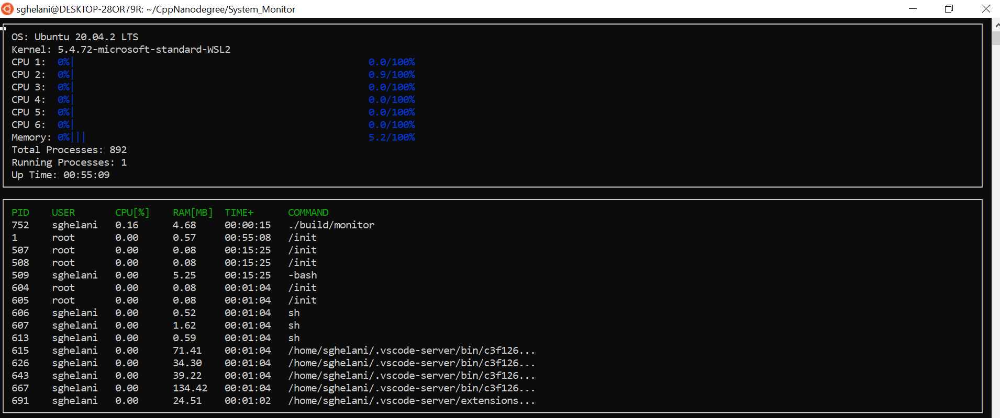

# System-Monitor
* Developed a Linux based Systems monitor using C++ which displays the CPU and Memory utilization of each CPU core and the running processes like the popular Htop application.

  

## Highlights
* The monitor displays the varying CPU utilization for each CPU core in the system and also the memory utilization of the whole system.
* The monitor displays the varying resource utilization of the top 15 processes sorted by CPU Utilization.
* It Displays other miscellaneous information related to system and processes.
* The data displayed on the screen gets refreshed every second.

## ncurses
[ncurses](https://www.gnu.org/software/ncurses/) is a library that facilitates text-based graphical output in the terminal. This project relies on ncurses for display output.

## Make
This project uses [Make](https://www.gnu.org/software/make/). The Makefile has four targets:
* `build` compiles the source code and generates an executable
* `format` applies [ClangFormat](https://clang.llvm.org/docs/ClangFormat.html) to style the source code
* `debug` compiles the source code and generates an executable, including debugging symbols
* `clean` deletes the `build/` directory, including all of the build artifacts

## Run instructions
* Install ncurses(If not installed): sudo apt install libncurses5-dev libncursesw5-dev
* Clone the project repository: git clone https://github.com/sghelani/CppNanodegree.git
* Go into the project folder: cd System_Monitor
* Clear the build dir: make clean
* Build the project newly: make build
* Run the resulting executable: ./build/monitor

## References
* Starter code for System Monitor Project in the Object Oriented Programming Course of the [Udacity C++ Nanodegree Program](https://www.udacity.com/course/c-plus-plus-nanodegree--nd213). 

